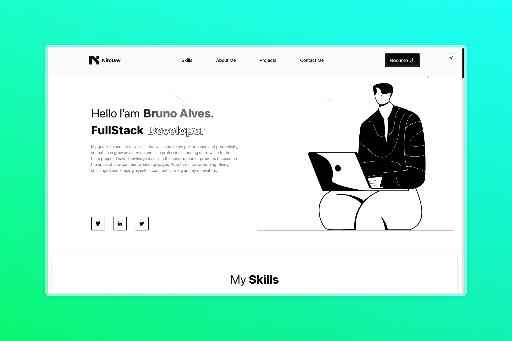

	<h1>Meu Portlófio</h1>
	
	

	

## 🚀 Introdução

Este projeto consiste no código fonte usado para construir o meu site portfólio

## 👨‍💻 Tecnologias

- [Javascript/Typescript](https://developer.mozilla.org/pt-BR/docs/Web/JavaScript): Linguagem de programação principal.
- [Astro](https://astro.build/): Framework utilizado para construição da interface.
- [ShadcnUI](https://ui.shadcn.com/): Biblioteca de componentes reaproveitáveis.
- [Tailwindcss](https://tailwindcss.com/): Framework css para construição de interface baseada em classes utilitárias.

## 🔧 Executando o projeto

Para rodar a aplicação você precisa ter o [NodeJS](https://nodejs.org/en) instalados na sua máquina. O projeto usa o pnpm como gerenciador de pacotes mas esteja livre para utilizar qualquer gerenciador da usa preferência.

- Rode o comando `pnpm i` para instalar as dependências.
- Rode o comando `pnpm dev` para inciar a aplicação.
- Abra no seu navegador o endereço http://localhost:4321 para visualizar a interface

## 🧑‍💻 Possíveis melhorias

- Adicionar uma maneira de colocar os projetos e habilidades de forma dinâmica ao site.

## 📄 Licença

Este projeto encontra-se sob a licença MIT. Acesse o link [LICENSE](https://mit-license.org/) para mais detalhes.

## 🌐 GitHub

O código dessa aplicação pode ser encontrado no GitHub: [Project Link](https://github.com/nitoba/shop-hub)

## 📧 Contato

Em caso de dúvidas ou sugestões entre em contato através do email: [nito.ba.dev@gmail.com](mailto:nito.ba.dev@gmail.com).
