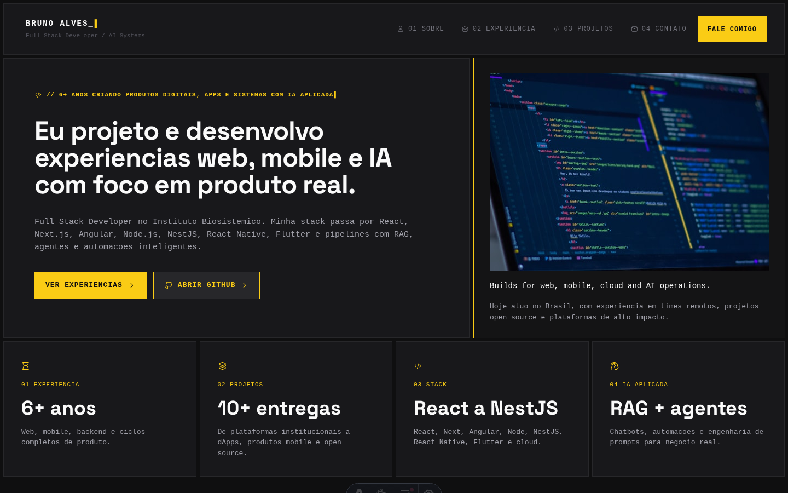

# nitodev — Portfolio



Portfolio pessoal construido com **Astro**, **Tailwind CSS v4** e **Hugeicons**.

## Stack

- **Framework:** [Astro](https://astro.build)
- **Styling:** [Tailwind CSS v4](https://tailwindcss.com) (CSS-first config)
- **Icons:** [Hugeicons](https://hugeicons.com) (CDN)
- **Fonts:** JetBrains Mono + Space Grotesk (Google Fonts)
- **Runtime:** [Bun](https://bun.sh)

## Rodando local

```bash
bun install
bun dev
```

Acesse `http://localhost:4321`

## Build

```bash
bun run build
```

Output em `dist/`.

## Deploy

Configurado para deploy automatico via Vercel conectado a este repositorio.

## Autor

**Bruno Alves** — [@nito_b_a](https://x.com/nito_b_a)
